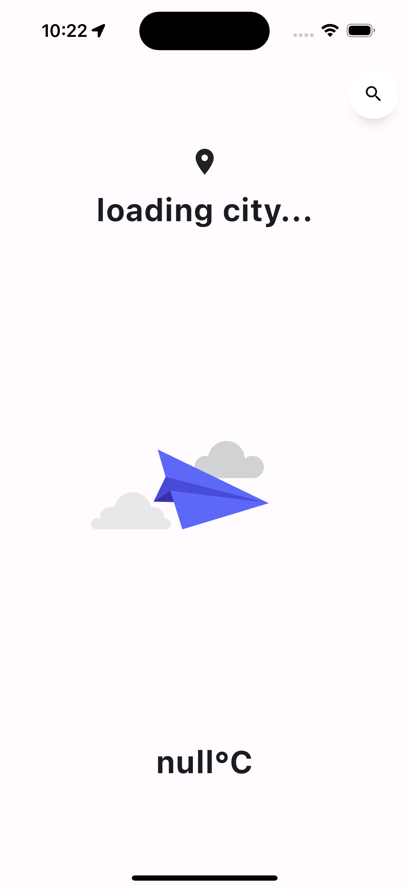
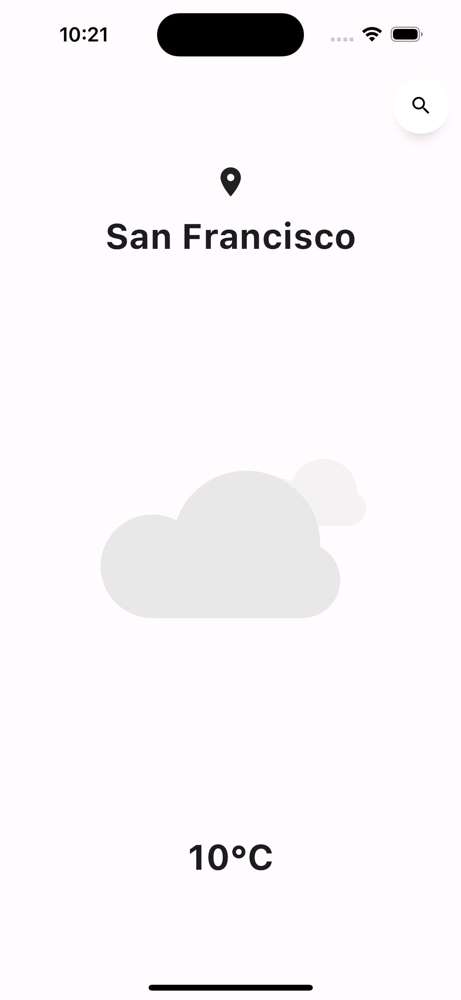
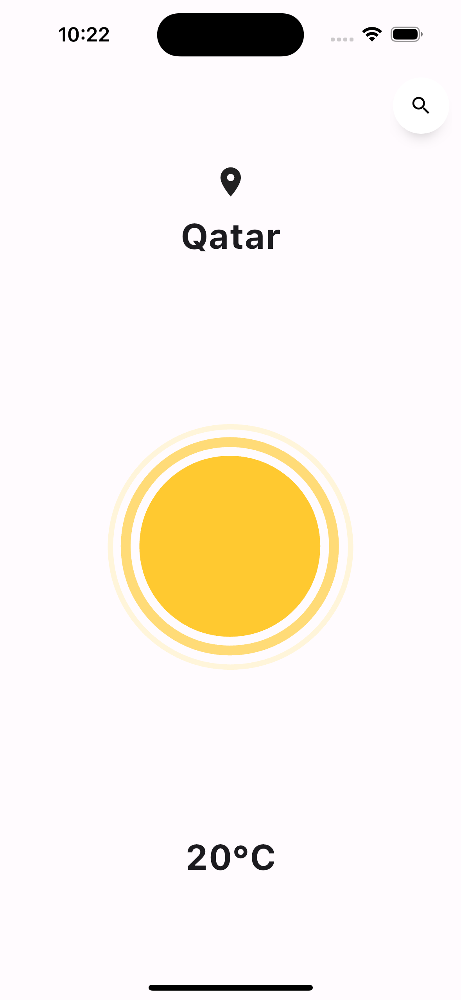

# weather_app

<div>
  
  
  
</div>

## Overview

This Flutter project is a customized weather app that provides real-time weather information for the user's location and allows them to search for weather in different places. The app was inspired by [Mitch Koko's YouTube tutorial](https://www.youtube.com/watch?v=yLtpMqvMgdY) but includes additional features and customizations.

## New Features

- **Custom UI:** The app has a customized user interface with minimalistic visual elements.

- **Search Functionality:** The app can search for weather in cities around the world.

## Getting started

1. **Clone the repository**:

   - Use Git to clone the project repository to your local machine:

     ```
     git clone git@github.com:JigmePwangyel/weather_app.git
     ```

2. **Set Up Your Environment**:

   - Navigate to the project directory and run the following command to get the required packages and dependencies:

     ```
     flutter pub get
     ```

3. **Run the App**:

   - Start the Flutter development server:

     ```
     flutter run
     ```

   This will launch the app in your emulator or on a connected device.
